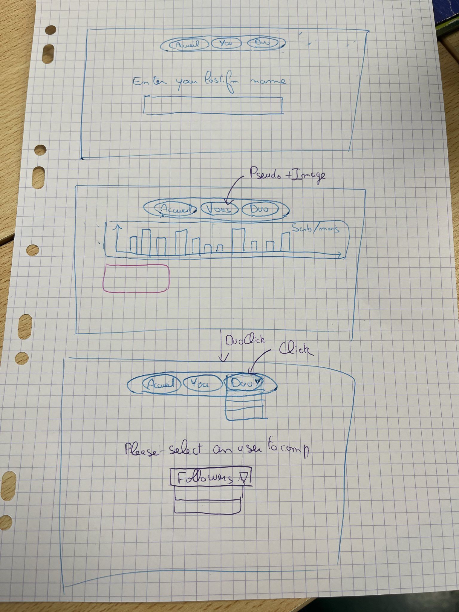
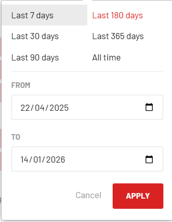

# Cours 1

**Base de données** : écoute du site [Last.fm](http://Last.fm) par utilisateur

**Objectif** : Dashboard sur les statistiques de l’utilisateur sélectionnée et une comparaison avec un autre utilisateur

### Tâche

- Création repot github + récupération de données csv pour commencer l’exploration des données
- Bar de navigation horizontal en haut, pas disponible nativement sur streamlit mais en recherchant dans la communauté, nous avons trouvé le package streamlit-community-navigation-bar qui fournit cette barre de navigation.

Description de notre idée de page : 

### Récupération des données : 

- Données statiques extraite à une période t créer la base
- Données statiques extraites + update avec l API quand l user entre son username

if user in bdd

extract (periode(ajd-last_scrobble))

else 

extract(all_time)

# Cours 2

Site uniquement en Anglais

Nom pour désigner une musique : Meloz

Faire page type page web avec explications

  *Filtre de temps compact application Last.fm.*

## **Contenu des différentes pages :**

### 1/ Accueil

### 2/ Solo

Filtre d’année pour tous OU plus libre

- Onglet Activity
    - Heatmap Annuelle de Meloz journaliers
- Onglet Bar Chart Race
    - Bar Chart Race
- Onglet Artistes
    - Top 10 Artistes Période
    - Top Artistes par nb total de semaine diff écoutées
    - Courbe de l’évolution des Meloz du top 10 artistes
    - Barchart de l’artiste le plus écouté par mois
    - Top Tracks par artistes
    - Pourcentage d’artistes feminins/masculins écoutés → requete LLM
- Onglet Track
    - Top 10 Tracks Periode
    - Top Tracks par nb total de semaine diff écoutées
    - Radar Horaire
        
- Onglet Albums
    - Top 10 Albums Période
    - Top Albums par nb total de semaines diff écoutées
    - Top Albums par style → Nécessite requete API

### 3/ Duo

Filtre d’année pour tous OU plus libre

- Onglet Activity
    - Heatmap utilisateur le + actif par jour
- Onglet Artist
    - Top 5 Artistes Communs les + streamés ( artiste stream par + de 80% par une personne non comptabilisé )
    - Courbe évolution nb d artistes differents par user sur la période
    - Treemap scindé en 2 des top 5 artistes
- Onglet Album
    - Top 5 Albums Communs les + streamés (idem condition artiste)
    - Courbe évolution nb de tracks differents par user sur la période
- Onglet Tracks
    - Top 5 Tracks Communs les + streamés (idem condition artiste)
    - Courbe évolution nb de tracks differents par user sur la période
    - Courbe evolution nb Meloz par personne

# Cours 3 
- Division des tâches : 
- Justin : Création des visualisations de la page Solo
- Gautier : Création des visualisations de la page Duo
- Ajout du filtre de temps 

# Travail à la maison
- Traduction de tout le site en anglais
- Ajout de la possibilité de mettre à jour les données d un utilisateur 
- Ajout de l'option d'ajouter un nouveau utilisateur à la base de données
- Gestion du cache optimisée
- Déploiement de l'application streamlit

